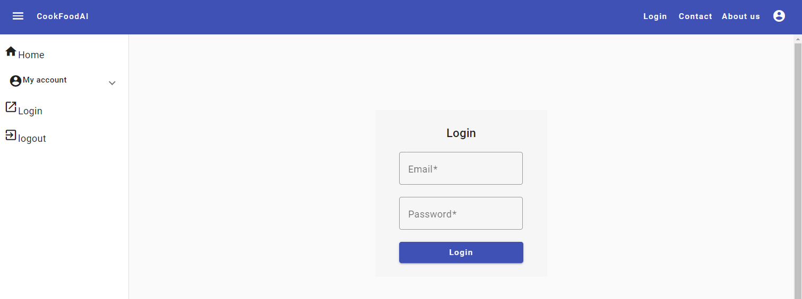
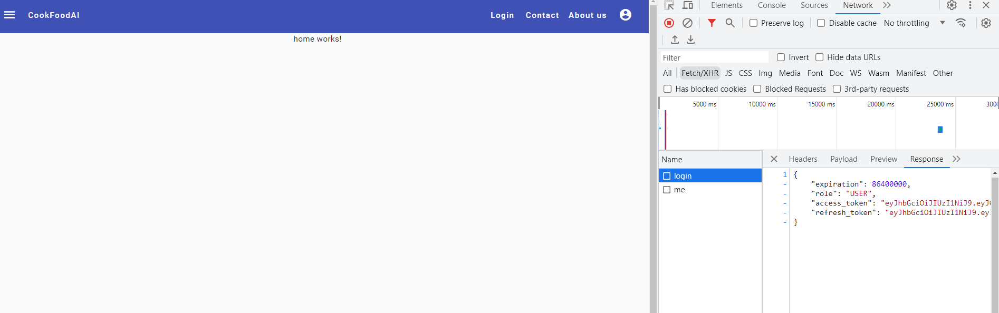

# CookFoodAI #

### About ###
The use of AI in e-commerce in a food store

** IN PROGRESS  **

Start project: 01.03.2024

# CookfoodAI Frontend

1. The client logs in to the application.
2. The customer enters the number of people and selects the type of meal.
3. In the AI application, three recipes for the addition are randomly selected along with the number of products available on the list.
4. The  customer selects one variant out of three available products to add to the basket.
5. The customer can only purchase the quantity that is needed for the recipe.

## Frontend Tech stack ###

[URL] [http://localhost:4200/]()

- [Angular CLI =  version 16.2.12]
- [Node = version 18.19.1]
- [Package Manager: npm 10.2.4]
- [Angular = CLI version 16.2.12]
- [Angular = CLI version 16.2.12]
- [SCSS]
- [Angular Material]
- [TypeScript]
- [NgRx] -> TO DO

## Login ###
[URL] [http://localhost:4200/login]()

```
user: user@example.com
password": 12345
```
or
```
user: admin@example.com
password: 12345
```

#### Download Code | Clone the Repo

```
git clone {repo_name}
```

#### Install Node Modules
```
npm install
npm install ngx-mask@8.2.0
ng add @angular/material
```

## Login



## Home




